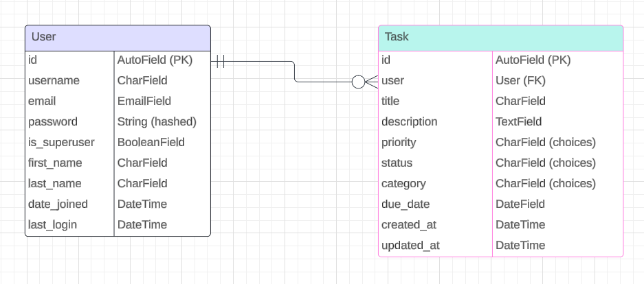

# FocusFlow


A Task Management Web-App developed using Django

Source code can be found [here](https://github.com/MFS4711/Hackathon-2-Task_Manager)

The live project can be viewed [here](https://focusflow-452b20672adc.herokuapp.com/)

---

## Table of Contents

1. [**Purpose of Project**](#purpose-of-project)

2. [**Features**](#features)
    - [All Users](#all-users)
    - [Authenticated (Logged in) Users](#authenticated-logged-in-users)
    - [Staff (Authenticated)](#staff-authenticated)
    - [Future Features](#future-features)

3. [**User Experience**](#User-Experience)
    - [Design](#design)
        - [Fonts](#fonts)
        - [Colour](#colour)
        - [Wireframes](#wireframes)

4. [**Development Process**](#development-process)
    - [Project Planning](#project-planning-and-documentation-using-gitHub)
    - [Search Engine Optimization](#search-engine-optimization)
    - [Data Model](#data-model)
    - [Data Validation](#data-validation)

5. [**Testing**](#Testing)
    - [Manual Testing](#manual-testing)
        - [Feature Testing](#feature-testing)
        - [Responsiveness](#responsiveness)
        - [Lighthouse](#lighthouse)
    - [Validation Testing](#validation-testing)
    - [User Story Testing](#user-story-testing)
    - [Automated Testing](#automated-testing)

6. [**Bugs**](#Bugs)

7. [**Libraries and Programs Used**](#libraries-and-programs-used)

8. [**Deployment**](#Deployment)
    - [Making a Local Clone](#making-a-local-clone)
    - [Running in Local Environment](#running-in-local-environment)
    - [Deploying to Heroku](#deploying-to-heroku)

9. [**Credits**](#credits)

10. [**Acknowledgements**](#acknowledgements)

---

# Purpose of Project

The Task Management App is designed to simplify task organisation, prioritisation, and progress tracking for individual users. It provides a central platform where users can create, categorise, and monitor their tasks with ease. By offering intuitive features such as priority settings, status tracking, and due date management, the app enhances productivity and streamlines task handling. Its goal is to minimise missed deadlines, improve task visibility, and promote better organisation, ultimately fostering a more focused and efficient workflow.

The primary users of the Task Management App are individuals looking for an effective way to manage their personal and professional tasks. The app enables users to organise tasks by category, such as Work, Personal, Study, Health, or Other, helping them maintain clarity and focus. Tasks can be prioritised with levels like High, Medium, or Low, while their progress is tracked through statuses such as To Do, In Progress, Completed, and Overdue. Additionally, users can manage deadlines with due dates and automated reminders, ensuring tasks are completed on time, while timestamps provide a clear record of updates.

Built with simplicity and adaptability in mind, the Task Management App empowers individuals to manage their workloads effectively and achieve their goals with ease.


---

[Return to top](#focusflow)

# Features

This section outlines the key features available to different types of users within the project. It describes pages and functionalities accessible to all users, authenticated users, and staff, highlighting the significance of each feature. Additionally, it includes a look at potential future features that could further enhance the user experience.

## All Users
The following pages are visible to all users, logged in or not.

<details>
<summary>Homepage (landing page)</summary>

### Key Features  

- **Primary Actions**:  
  The landing page offers users two clear options:  
  - Sign Up/ Get Started
  - Log in  

- **Header Navigation**:  
  The header includes the following elements, displayed left to right:  
  - **Site Icon**: Clickable, redirects users back to the homepage from any page.  
  - **Nav-links**:  
    - Home (with an active class to indicate the current page; appears bold and underlined) 
    - Contact
    - Login
    - Register

  #### Role-Based Navigation Modifications:  
  - **Authenticated Users**:  
    - **Dashboard**: Appears between Home and Contact links.  
    - **Logout**: Replaces the Login and Register links.   

### Hero Section  

- **Visuals**:  
  - The opening viewport prominently displays a motivational statement with the action button, positioned over a full-screen hero image which is the logo.  

- **Actions**:  
  - One clear button:  
    - Sign Up/ Get Started
  Both buttons redirect users to their respective pages. 

 

### Secondary Content  

- **About Section**:  
  - Highlights the company's focus and reasoning for web app

- **Web App Functions**:  
  - Displayed in a **distinctive card layout**.  

- **Reminder Actions**:  
  - Additional buttons for "Get Started" and "Login" to reinforce the main actions on the page.  

 

### Footer  

- The footer is consistent across all pages and divided into four sections:  
  - **Company Logo**: Clickable, redirects users to the landing page.  
  - **Key Features**: Displays the project functionalities. 
  - **Address**: Shows the physical location of the business.  
  - **Get in Touch and Socials**: Provides contact details and social media links. 

 

</details>

<details>
<summary>Contact Page</summary>
This page simply shows the navbar and the footer which takes up the whole viewport as this displays the contact details in a clear manner.

- The footer is consistent across all pages and divided into four sections:  
  - **Company Logo**: Clickable, redirects users to the landing page.  
  - **Key Features**: Displays the project functionalities.   
  - **Address**: Shows the physical location of the business.  
  - **Get in Touch and Socials**: Provides contact details and social media links. 


</details>

<details>
<summary>Login Page</summary>

This is the standard allauth login page, styled with the site styling.


</details>

<details>
<summary>Register Page</summary>

This is the standard allauth signup page, with fields for email, username, and password + password confirmation. All fields bar the email are required.


</details>

## Authenticated (Logged in) Users
The following pages are only available to logged in users.

<details>
<summary>Dashboard Page</summary>

<!-- REMOVE WHEN SECTION COMPLETED -->


</details>

<details>
<summary>Logout Page</summary>

This is the standard allauth logout page, with a button to logout.


</details>


## Future Features
<!-- REMOVE WHEN SECTION COMPLETED -->
<!-- List Future Features -->

---

[Return to top](#focusflow)

# User Experience

This section details the key elements of the user experience (UX) design for the project, including visual design choices, color schemes, typography, and wireframes. It provides insight into the aesthetic and functional decisions made to enhance usability across different devices, ensuring a seamless and accessible experience for users.

## Design

### Fonts

The Outfit font was used throughout the project for headings and prominent text. It's a modern, versatile sans-serif font with a clean and professional look, making it ideal for a task manager web app. Its bold, uppercase styling helps convey a sense of clarity and structure, perfect for emphasising key tasks and information.

For body text, Inter was chosen due to its simplicity and excellent legibility, offering a comfortable reading experience for users. Its balanced and neutral design makes it ideal for long-form content, maintaining a polished, cohesive aesthetic throughout the app.

### Colour
The following colour palette was used in the project:


- **#F5F7FA (Anti-Flash White):** Used for body text, providing readability on dark backgrounds and ensuring clarity for users.
- **#42C5F5 (Vivid Sky Blue):** Highlights important elements like headings, links, and buttons, drawing attention to key actions such as navigation and form submissions.
- **#1A3744 (Gunmetal):** Used as the primary background color to create a dark, professional atmosphere while maintaining contrast with lighter text for readability.
- **#081424 (Rich Black):** Applied to footer backgrounds and certain section overlays to separate content areas, adding depth and focus to the design.

#### _Colour Contrast (Font against Background)_

<details>
<summary>#F5F7FA (Anti-Flash White) and #1A3744 (Gunmetal)</summary>


</details>

<details>
<summary>#F5F7FA (Anti-Flash White) and #081424 (Rich Black)</summary>


</details>

<details>
<summary>#42C5F5 (Vivid Sky Blue) and #1A3744 (Gunmetal)</summary>


</details>

### Wireframes
These wireframes illustrate how each page is designed to adapt across various screen sizes, including Mobile, Tablet, Desktop, and Larger Screens. While the overall layout remains consistent, adjustments have been made to optimize the user experience for each viewport. Key differences include variations in button placement, layout, and card arrangements to ensure usability and visual clarity across devices.

#### _Homepage (Landing Page)_

<details>
<summary>Mobile</summary>


</details>

<details>
<summary>Tablet</summary>


</details>

<details>
<summary>Desktop</summary>


</details>

#### _Dashboard_

<details>
<summary>Mobile</summary>


</details>

<details>
<summary>Tablet</summary>


</details>

<details>
<summary>Desktop</summary>


</details>

---
[Return to top](#focusflow)

# Development Process

The development process for this project was carefully planned and documented to ensure efficient progress and transparency. This section outlines how the project was broken down into manageable tasks, tracked, and prioritized using GitHub Issues and Projects. It also covers the key steps taken, including project planning, SEO, data modeling, and data validation. Each sub-section provides a detailed look at the tools and methods used to guide development from initial planning to implementation.

## Project Planning and Documentation Using GitHub
GitHub Issues were used to document the development steps undertaken in the project. 
Two issue templates were created: one for [User Epics](https://github.com/MFS4711/Hackathon-2-Task_Manager/issues/templates/edit) and another for [User Stories](https://github.com/MFS4711/Hackathon-2-Task_Manager/issues/templates/edit).
A variety of labels were applied to categorise issue types, such as Bugs, User Epics and User Stories, with the parent epic and child story being associated with the same label for easy identificaion.
MoSCoW prioritisation was applied using the labels must-have, should-have, and could-have.

The project was broken down into manageable sprints using GitHub Projects, which provided a Kanban board. Issues were posted to the board and moved from "Todo" to "In Progress" to "Done" as they were completed. Due to time constraints, only Iteration 1 was completed, though future iterations were planned. This initial planning outlines the anticipated development of the application.

The iterations are documented here :
  - [MVP](https://github.com/users/MFS4711/projects/7/views/1)
  - [Iteration 2](https://github.com/MFS4711/Hackathon-2-Task_Manager/milestone/2)
  - [Iteration 3](https://github.com/MFS4711/Hackathon-2-Task_Manager/milestone/3)

The User Epics and their related User Stories are as follows:
- Epic : [User Authentication](https://github.com/MFS4711/Hackathon-2-Task_Manager/issues/1)
    - Story : [User Registration](https://github.com/MFS4711/Hackathon-2-Task_Manager/issues/2)
    - Story : [User Login](https://github.com/MFS4711/Hackathon-2-Task_Manager/issues/3)
    - Story : [User Logout](https://github.com/MFS4711/Hackathon-2-Task_Manager/issues/4)
    - Story : [Password reset](https://github.com/MFS4711/Hackathon-2-Task_Manager/issues/5)
- Epic : [Task Management](https://github.com/MFS4711/Hackathon-2-Task_Manager/issues/6)
    - Story : [Create a Task](https://github.com/MFS4711/Hackathon-2-Task_Manager/issues/7)
    - Story : [View task list](https://github.com/MFS4711/Hackathon-2-Task_Manager/issues/8)
    - Story : [Update a Task](https://github.com/MFS4711/Hackathon-2-Task_Manager/issues/9)
    - Story : [Delete a Task](https://github.com/MFS4711/Hackathon-2-Task_Manager/issues/10)
    - Story : [Mark Task as completed](https://github.com/MFS4711/Hackathon-2-Task_Manager/issues/11)
- Epic : [Task Filtering and Sorting](https://github.com/MFS4711/Hackathon-2-Task_Manager/issues/12)
    - Story : [Sort Tasks by Due Date](https://github.com/MFS4711/Hackathon-2-Task_Manager/issues/13)
    - Story : [Overdue Tasks](https://github.com/MFS4711/Hackathon-2-Task_Manager/issues/14)
    - Story : [Add Task Categories](https://github.com/MFS4711/Hackathon-2-Task_Manager/issues/15)
    - Story : [Filter Tasks by Category](https://github.com/MFS4711/Hackathon-2-Task_Manager/issues/16)
    - Story : [Sort Tasks by priority](https://github.com/MFS4711/Hackathon-2-Task_Manager/issues/29)
    - Story : [Search Tasks by Keywords](https://github.com/MFS4711/Hackathon-2-Task_Manager/issues/30)
- Epic : [Task Display and Interface](https://github.com/MFS4711/Hackathon-2-Task_Manager/issues/17)
    - Story : [Display Tasks in a Table](https://github.com/MFS4711/Hackathon-2-Task_Manager/issues/18)
    - Story : [7-Day Calendar View](https://github.com/MFS4711/Hackathon-2-Task_Manager/issues/19)
    - Story : [Task Due Date Indicator](https://github.com/MFS4711/Hackathon-2-Task_Manager/issues/20)
- Epic : [User Experience and Visual Features](https://github.com/MFS4711/Hackathon-2-Task_Manager/issues/21)
    - Story : [Task Progress Tracker](https://github.com/MFS4711/Hackathon-2-Task_Manager/issues/22)
    - Story : [Customise Task Table](https://github.com/MFS4711/Hackathon-2-Task_Manager/issues/23)
- Epic : [Notifications and Reminders](https://github.com/MFS4711/Hackathon-2-Task_Manager/issues/26)
    - Story : [Notification of due date](https://github.com/MFS4711/Hackathon-2-Task_Manager/issues/31)
- Epic : [Task Gamification and Motivation](https://github.com/MFS4711/Hackathon-2-Task_Manager/issues/27)
    - Story : [Points System](https://github.com/MFS4711/Hackathon-2-Task_Manager/issues/24)
    - Story : [Task Streak Tracker](https://github.com/MFS4711/Hackathon-2-Task_Manager/issues/25)
    - Story : [Timer for Task Focus](https://github.com/MFS4711/Hackathon-2-Task_Manager/issues/28)

## Data Model
This section provides an overview of the data models used in the project, represented through Entity-Relationship Diagrams (ERDs) for each application. Each sub-heading corresponds to a specific app, detailing its database schema and the relationships between key entities. These ERDs were drawn using [Lucidchart](https://www.lucidchart.com/pages/) and offer a clear visualization of how data is structured and flows within the application.

### Task Management App



#### `User` Table:
The `User` table represents users in the system. It contains key information related to user authentication, account creation, and user details. Key fields include:
- `id`: A unique identifier for each user (primary key).
- `username`: The user's chosen username.
- `email`: The user's email address.
- `password`: A hashed version of the user's password.
- `is_superuser`: A boolean flag indicating if the user has superuser privileges.
- `first_name`: The user's first name.
- `last_name`: The user's last name.
- `date_joined`: Timestamp for when the user account was created.
- `last_login`: Timestamp for the user's most recent login.

#### `Task` Table:
The `Task` table tracks tasks assigned to users in the system. It holds key information related to task details and progress. Key fields include:
- `id`: A unique identifier for each task (primary key).
- `user`: A foreign key linking to the `User` table, indicating which user the task is assigned to.
- `title`: The title of the task.
- `description`: A detailed description of the task.
- `priority`: The priority level of the task (e.g., low, medium, high).
- `status`: The current status of the task (e.g., pending, in-progress, completed).
- `category`: The category or type of task (e.g., work, personal, study).
- `due_date`: The due date for the task's completion.
- `created_at`: Timestamp for when the task was created.
- `updated_at`: Timestamp for when the task was last updated.

#### Relationships:
1. **User to Task**: 
   - A one-to-many relationship exists between the `User` and `Task` tables. One user can be assigned multiple tasks, but each task is assigned to one user.

#### `on_delete` Considerations:
- **User Deletion**:  
  If a user is deleted, the tasks associated with that user are also deleted. This is due to the `CASCADE` deletion strategy, which ensures that when a user is deleted, all tasks related to that user will also be removed from the database.

### Core App

This app does not contain any models. It is designed to serve as a container for the homepage and contact page, which do not require interaction with any models.

## Data Validation

<!-- REMOVE WHEN SECTION COMPLETED -->

<!-- Any specific custom validation - Js/python -->

---

[Return to top](#focusflow)

# Testing

The Testing section covers various strategies used to ensure the application's functionality and quality. This includes **manual testing** for hands-on verification, **validator testing** to check data integrity, **user story testing** to confirm features meet user requirements, and **automated testing** to streamline repeated tests and ensure consistent performance throughout development. Each approach contributes to a robust, error-free application.

## Manual Testing

### Feature Testing
The manual testing of features is organised by app below. Testing was carried out on a 1920 x 1080 desktop screen, a Samsung tablet and an Samsung S22 Ultra.

<details>
<summary>Core App, Navbar and Footer</summary>

|Page|Feature|Action|Effect|
|---|---|---|---|
|/|Hero Image and Company Logo appear|Navigate to page|Elements appear correctly|
|/|'Menu' button links to /menu/ page|Click button|User is redirected to correct page|
|/|'Book a Table' button links to /booking/ page|Click button|User is redirected to correct page|
|/|Navbar - Logo button causes page to reload|Click logo|Page reloads/redirects to homepage if not already on it|
|/|Navbar - small screens - dropdown icon reveals all nav links|Click dropdown button|Correct Links appear|
|/|Navbar - larger screens - all nav-links visible|Navigate to page|Elements appear correctly|
|/|Navbar - larger screens - all nav-links visible|Navigate to page|Elements appear correctly|
|/|Navbar - Home link leads to / |Click link|User redirected to home page|
|/|Navbar - Authenticated user - Dashboard link leads to /dashboard/ |Click link|User redirected to User Dashboard page|
|/|Navbar - Contact link leads to /contact/|Click link|User redirected to Contact page|
|/|Navbar - Login link leads to /login/|Click link|User redirected to Login page|
|/|Navbar - Sign Up link leads to /signup/|Click link|User redirected to Sign Up page|
|/|Navbar - Authenticated users (all) - Logout link leads to / |Click link|User redirected to Home page|
|/|Footer - Logo image causes page to reload|Click logo|Page reloads/redirects to homepage if not already on it|
|/contact/|Logo images redirects user to homepage|Click logo|Page redirects to homepage|
|||||

</details>

<details>
<summary>Dashboard App</summary>

<!-- REMOVE WHEN SECTION COMPLETED -->

|Page|Feature|Action|Effect|
|---|---|---|---|
|/customer-dashboard/<int:user_id>/|Unauthorised user - attempt to access a customer dashboard|Search customer-dashboard/n (n is any integer)|User is redirected to the homepage with an error message advising unauthorised access|
|||||
</details>

### Responsiveness
All pages on the live site were tested with the default list of devices in Chrome Devtools. Special attention was given to ensuring the hero image carousel displayed optimally across screen breakpoints, with images specifically optimized for responsive viewing.

### Lighthouse
The Lighthouse testing was carried out using a chrome extension which can be found [here](https://chromewebstore.google.com/detail/lighthouse/blipmdconlkpinefehnmjammfjpmpbjk).
The results are displayed by page below:

<details>
<summary>Lighthouse results by page</summary>

<!-- REMOVE WHEN SECTION COMPLETED -->

- Homepage (Landing Page)


- ... Page


- Contact Page


- Login Page


- Sign Up Page


- All other pages are protected so are inaccessible with the lighthouse extension


</details>

## Validation Testing

### Python Validation

All python code is validated by the [Flake8 linter](https://flake8.pycqa.org/en/latest/) (installed in VSCode) and [CI Python Linter](https://pep8ci.herokuapp.com/). The exceptions to this were django migration files, urls and similar files. However, any custom models, views and forms were validated. I have separated this by app:

<details>
<summary>Core App</summary>

- views.py


</details>

<details>
<summary>Task Management App</summary>

- models.py


- forms.py


- views.py


- admin.py


- test_models.py


</details>

### JavaScript Validation

All JavaScript code is validated by the [ESLint](https://eslint.org/) (installed in VSCode) and [JS Hinterface](https://mfs4711.github.io/jshint-api/). Custom JS was present only in the Booking and Menu Apps respectively.

<details>
<summary>Task Management App</summary>


</details>

### HTML Validation

All HTML was validating using the page source of the deployed project using [W3C Markup Validation Service](https://validator.w3.org/). All pages were clear of all errors/warnings. There was only one page where an additonal factor was noted. This was on the menu page which had an 'info' warning. This was related to the way the Cloudinary image is used in the menu item modal.

<details>
<summary>All Pages</summary>


</details>

### CSS Validation

The single CSS file was validated using the [W3C Validation Service](https://jigsaw.w3.org/css-validator/)

<details>
<summary>Results</summary>


</details>

## User Story Testing
The User Epics and Stories for this project are documented across 3 GitHub Projects, each corresponding to a specific iteration of the development work. However, as already mentioned only Iteration 1 has been addressed thus far with the remaining Iterations noted as part of future implementation. You can find the relevant Iterations here:

- [Iteration 1](https://github.com/users/MFS4711/projects/7/views/1)
- [Iteration 2](https://github.com/MFS4711/Hackathon-2-Task_Manager/milestone/2)
- [Iteration 3](https://github.com/MFS4711/Hackathon-2-Task_Manager/milestone/3)

Alternatively, the Epics and Stories are individually linked here :

- [Epics and Stories](#development-process)

In both cases, the status of each issue will indicate whether the user story has been completed.

## Automated Testing

### Testing django views, models and forms

Comprehensive automated testing of the Models for the Task Management has been completed and data integrity as well as transition of task status' was ensured.

Testing of the Forms and Views has not been completed primarily due to losing team members throughout this project and thus leading to a lack of time to implement for the remaining members.

---

[Return to top](#focusflow)

# Bugs

This section provides an overview of the bugs encountered during development, along with their resolutions. Any remaining issues or notable fixes are also tracked for reference.

There were no notable bugs found although extensive testing has not been possible due to loss of team members.

## Remaining Bugs

There are hopefully no bugs remaining.

---

[Return to top](#focusflow)

# Libraries and Programs Used

This section highlights the key libraries, tools, and platforms utilised throughout the development of the project. These technologies played an essential role in various aspects of the project, from wireframing and version control to deployment and testing.

1. [Balsamiq](https://balsamiq.com/)
    - Balsamiq was used to wireframe all the pages in the project.
2. [Git](https://git-scm.com/)
    - Version control was implemented using Git through the GitHub terminal.
3. [Github](https://github.com/)
    - GitHub was used to store the project after being pushed from Git. The cloud service GitHub Pages was used to deploy the project on the web, while GitHub Projects tracked User Stories, Epics, bugs, and other issues throughout the development.
4. [Gitpod](https://www.gitpod.io/)
    - Gitpod was used as the primary IDE for development, with ESLint and Flake8 linters configured for JavaScript and Python code validation, respectively.
5. [Heroku](https://www.heroku.com/)
    - Heroku was used for deploying the project.
6. [pytest](https://docs.pytest.org/en/7.1.x/)
    - Pytest was used for automated testing of the project.
7. [Photoroom](https://www.photoroom.com/tools/transparent-background)
    - Photoroom was used to transfomr images to have a transparent background
8. [ChatGPT](https://chatgpt.com/)
    - ChatGPT was the primary AI tool used to aid development through a variety of areas such as bug-fixing, tests devlopment, introduction to form and model methods, improving accessibility and code maintainability as well as initial planning such as outlining scope and developing Epics and Stories.

---

[Return to top](#focusflow)

# Deployment

This section outlines the steps required to deploy your project to Heroku, ensuring that all configurations and settings are properly set for both development and production environments. Before proceeding with deployment, you will clone the repository to your local machine to safely develop without modifying the original codebase. Follow these steps to set up the app locally, deploy it to Heroku, and configure essential services such as the database, social logins, and payment processing. By the end of this guide, your app will be live and accessible on the web.

## Deploying to Heroku
1. **Log into Heroku** and navigate to the Dashboard.
2. Click the **'New'** button.
3. Choose a **unique app name** and select the region relevant to you.
4. **Create a Database** - As a student at Code Institute, I used [CI Database Maker](https://dbs.ci-dbs.net/) but this can also be achieved on Heroku by paying a monthly fee and following the below steps:
    - Head to the Resources tab.
    - Click on Find more add-ons.
    - Search for Heroku Postgres and select it, then click Install Heroku Postgres.
    - Pick a plan, then choose your app.
    - Go back to the Resources tab, click on the Heroku Postgres icon, and open the Settings tab. Click Database Credentials and copy the URL to your clipboard.
    - Paste this URL into your env.py file under the key DATABASE_URL. This ensures you’re using the same database for both development and production environments.

5. Go to the **Settings** tab, and click **Reveal Config Vars**. Add the following config variables, if not already present:
    - **Django secret key**
    - **Database URL**
    - **Cloudinary API**

6. In your **local repository**, add a **Procfile** to the root directory with this content:

    `web: gunicorn title.wsgi`

7. Add your Heroku app URL to the `ALLOWED_HOSTS` list in `settings.py`.

8. Set `DEBUG` to `False` in `settings.py`, then commit and push your changes to GitHub.
9. Navigate to the **Deploy** tab in the Dashboard. Under **Deployment Method**, click the **GitHub** icon to connect your Heroku app to your GitHub repository.
    - Enter your repository name, click **Search**, then click **Connect**.
10. Under the **Manual Deploy** section, click **Deploy Branch**. Once deployed, you should see the message **"Your app was successfully deployed"**.
11. Click **Open App** to open the app in the browser.

## Making a Local Clone
1. Open a terminal/command prompt on your local machine.
2. Navigate to the directory where you want to clone the project.
3. Run the following command to clone the repository :

    `git clone 'REPO_LINK'`

## Running in Local Environment
1. Create a virtual environment in the newly cloned project folder using:
    ```bash
    python3 -m venv venv
    ```
2. Activate the virtual environment:
    ```bash
    source venv/bin/activate
    ```
3. Install the project dependencies:
    ```bash
    pip3 install -r requirements.txt
    ```
4. Create an `env.py` file with the following environment variables:
    - `BASE_URL`: The root URL for the local dev project (usually `http://localhost:8000/`).
    - `DATABASE_URL`: The URL generated by Heroku (see the deployment section).
    - `DEBUG`: Set this to `True` for local development.
    - `PORT`: Default Django port, typically 8000.
    - `SECRET_KEY`: The Django secret key.

---

[Return to top](#focusflow)

# Credits

- [MFS4711 - Restaurant Web App Readme Template](https://github.com/MFS4711/Restaurant-Web-App)


# Acknowledgements

We would like to acknowledge our team members who put effort into creating a functional product. ALthough it is not as refined as initially desired, mitigating circumstances were overcome during the development.

---

[Return to top](#focusflow)